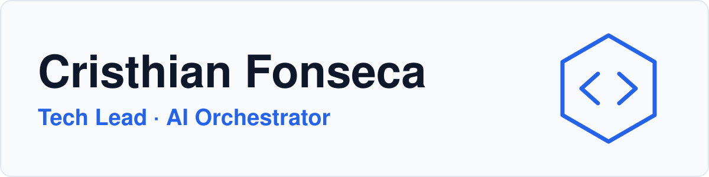
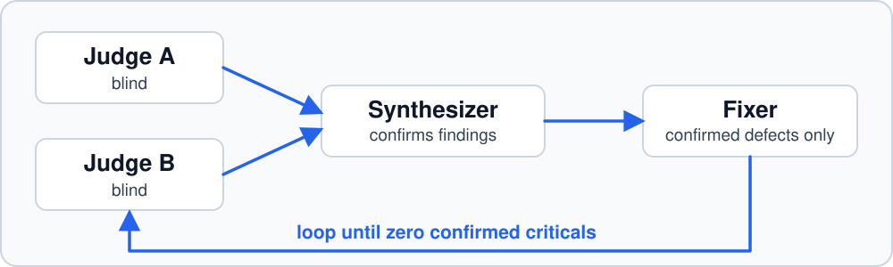

<picture>
  <source media="(prefers-color-scheme: dark)" srcset="assets/banner-dark.svg">
  <source media="(prefers-color-scheme: light)" srcset="assets/banner-light.svg">
  
</picture>

**I design multi-agent systems that ship production software, and I make sure the technology serves the business, not the other way around.**

Leading engineering or building with AI agents? **[Work with me](https://crisfon6.com/work-with-me)** · **[Read PowerAI](https://crisfon6.com/newsletter)**

## Receipts

<table>
  <tr>
    <td align="center" width="33%"><h3>−43%</h3>AWS bill after a cost audit</td>
    <td align="center" width="33%"><h3>30×</h3>faster export (638K rows in 21 s)</td>
    <td align="center" width="33%"><h3>5+ years</h3>shipping to production</td>
  </tr>
  <tr>
    <td align="center"><h3>287.89 MB → 6.98 MB</h3>Redis after an incident fix</td>
    <td align="center"><h3>83.4% → 100%</h3>identity match rate</td>
    <td align="center"><h3>Anthropic certified</h3>Claude Code in Action</td>
  </tr>
</table>

## What I'm building

<table>
  <tr>
    <td valign="top" width="50%">
      <h3>Prosperas</h3>
      <b>~100K monthly active users</b> in a 45M-user ecosystem. 
      Technical Lead on a digital credit marketplace inside a telecom super app. AWS, fully codified with CDK.
    </td>
    <td valign="top" width="50%">
      <h3>Aphrodite (private)</h3>
      <b>3,000+ automated tests · 17 s production rollback · ~US$86/month infrastructure.</b> 
      AI companion marketplace that fights loneliness with an AI that actually knows each user. Solo founder and tech lead, built with a multi-agent engineering org I designed.
    </td>
  </tr>
</table>

## How I work: an engineering org made of agents

<picture>
  <source media="(prefers-color-scheme: dark)" srcset="assets/pipeline-dark.svg">
  <source media="(prefers-color-scheme: light)" srcset="assets/pipeline-light.svg">
  
</picture>

<table>
  <tr>
    <td valign="top" width="50%">
      <b>Autonomous backlog runner</b> 
      Pulls issues from Linear and works them in isolated workspaces. First full run: <b>13 issues → 11 merged PRs in one day.</b>
    </td>
    <td valign="top" width="50%">
      <b>MCP over production data</b> 
      An MCP server that lets the business query real data. I traced a <b>98.4% undercount</b> and fixed it; 30+ attack shapes tested, 0 leaks.
    </td>
  </tr>
</table>

## Open source

- **Code:** [ai-org-agents](https://github.com/Crisfon6-dev/ai-org-agents) — config-driven AI team (Founder, CTO, Marketer, PO, Coder) with shared Obsidian memory and adaptive model routing.
- **Code:** [crisfon6-website](https://github.com/Crisfon6-dev/crisfon6-website) — my portfolio: Next.js 16, bilingual, verifiable numbers.

## Stack

**AI** — Claude API · Claude Code · MCP · multi-agent orchestration · pgvector/RAG 
**Cloud** — AWS (CDK, Lambda, RDS, ElastiCache, Cognito, S3) · Docker · CI/CD 
**Code** — Python/FastAPI · TypeScript/Next.js · Angular · Java/Spring Boot · PostgreSQL

---

Building something ambitious? **[Let's talk](https://crisfon6.com/work-with-me)**.

Technology serves the business. LATAM talent, global problems.

